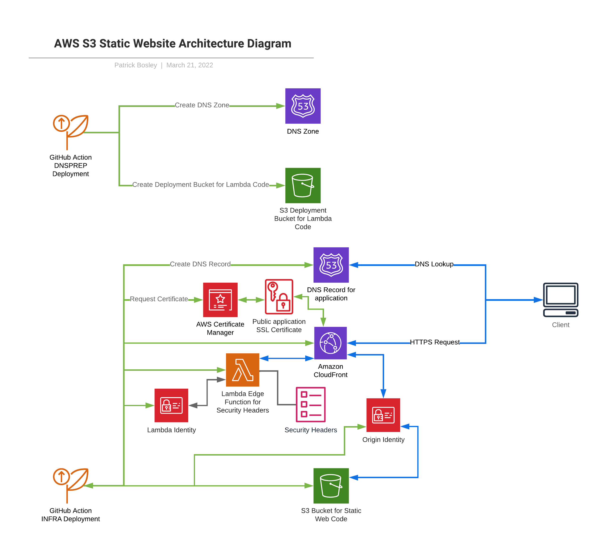

## Estee Lauder Assessment Challenge (grubtrucks)

## Summary

Not being a true developer and mainly dabbling in it from a hobbyist perspective, I looked at this challange as an educational opportunity.
I chose to tackle this using Javascript for all of the dynamic requirements as the API did not require any authentication, so there was no security concerns regarding the call.
Furthermore, this reduced the compute requirements from the server side, minimizing costs. The dataset received by the API call was quite small which also supported the edge compute decision.

This was also my first attempt at using GitHub actions for deployment.
We are primarily a GitLab shop, so I had to familiarize myself with the syntax differences. 
There is definitely some additional logic efficiencies that could be incorporated into the GitHub Actions that I did not have time to research and implement.

### Demo Site

I deployed this to https://grubtrucks.patrickbosley.com for demonstration purposes.

## Code

### UI

For the UI I grabbed a free BootStrap template to make the site a bit presentable. 
I made the following minor modifications to the template
* Removed user profile components
* Removed static table elements as I planned to populate them with the JavaScript function
* Modified the DataTable.js to remove the check for an empty table element during page load. I would have preferred to avoid modifying this file as it will complicate updates. However I did not have the time to investigate further.


### JavaScript/Stylesheet References

I put the required JavaScript and StyleSheet files for the UI in their respective subdirectories (js/css).
Typically, I would put these files in an internal managed package and include them. 
This provides the development operations team more granular control of change within the application versus 
referencing the packages from their external source or using static copies which go stale.

### JavaScript Code

I created a JavaScript function ./src/js/grubtrucks.js that includes all of functions that I wrote to pull and display data from the Open API.

## Infrastructure

I chose to use an AWS Static WebSite architecture for this project. The deployment, as detailed later, is done in 2 parts to
account for the DNS zone creation ahead of the certificate creation which needs to have the DNS publicly available for validation of the request.

The diagram below outlines the architecture.

## Diagram



## Deployment

### Requirements/Preparation

* Adjust Variables as needed
    * FQDN: Fully Qualified Domain Name of Site
    * DEPLOYBUCKET: S3 bucket name for Lambda Code deployment
    * BUCKETNAME: S3 bucket name for web-content
    * WEBSTACK: Cloud Formation Stack Name for the Static Web Application
    * DNSSTACK: Cloud Formation Stack Name for the DNS Preparation
    * ENV: Environment name
    * ORGUNIT: Organizational Unit for reporting
    * PROJECT: Project name
    * REQUESTER: Person requesting resources

* AWS Account for deployment
    * IAM User Account with programmatic access for the access key secrets below
        * User Inline Policy - to assume role
        ````JSON
        {
            "Version": "2012-10-17",
            "Statement": [
                {
                    "Sid": "VisualEditor0",
                    "Effect": "Allow",
                    "Action": [
                        "sts:AssumeRole",
                        "sts:TagSession"
                    ],
                    "Resource": [
                        "arn:aws:iam::489312212545:role/<iamrole>"
                    ]
                }
            ]
        }
        ````
* IAM Role for deployment
    * IAM Role with required priviledges to deploy resources to the AWS Account
        * Trusted entities
        ````JSON
        {
            "Version": "2012-10-17",
            "Statement": [
                {
                    "Effect": "Allow",
                    "Principal": {
                        "AWS": "arn:aws:iam::489312212545:user/<iamuser>"
                    },
                    "Action": [
                        "sts:AssumeRole",
                        "sts:TagSession"
                    ]
                }
            ]
        }
        ````
        * Permissions
            * AdministratorAccess (We are creating IAM roles, so no reason to restrict really.)
* Secrets:

    Place the Access Keys and Role Names in the appropriate Secrets in GitHub

    * AWS_ACCESS_KEY_ID
    * AWS_SECRET_ACCESS_KEY
    * AWS_ROLE_TO_ASSUME

### Process

I used commit substrings to determine which actions to take during a deployment.
* "dnsprep"
    * deploys the DNS Zone and S# deployment bucket for the security header lambda function
* "infra"
    * deploys the static website, including Security header Lambda function and web contents
* neither of the above
    * deploys just the web content to the S3 bucket

#### DNS Prep

* Commit to the project with "dnsprep" in the commit string
* This will initiate the CloudFormation deployment for the DNS preparation
* Once completed, check the output of the "Output DNS Zone Name Servers" action of the deployment
* Create Name Server records in the parent domain for each of the records listed in the previous step
* Proceed to infrastructure deployment

NOTE: The infrastructure stack will use AWS CLoud Formation Cross-Stack references to get the DNS Zone ID from this stack

#### Infrastructure Deployment

* Commit to the project with "infra" in the commit string
* This will initiate the CloudFormation deployment for the WebSite
* Once completed, the site will be available at the Fully Qualified Domain Name

### Updates

* Commiting to the project WITHOUT either of the above will only update the Web Content in the S3 Bucket


